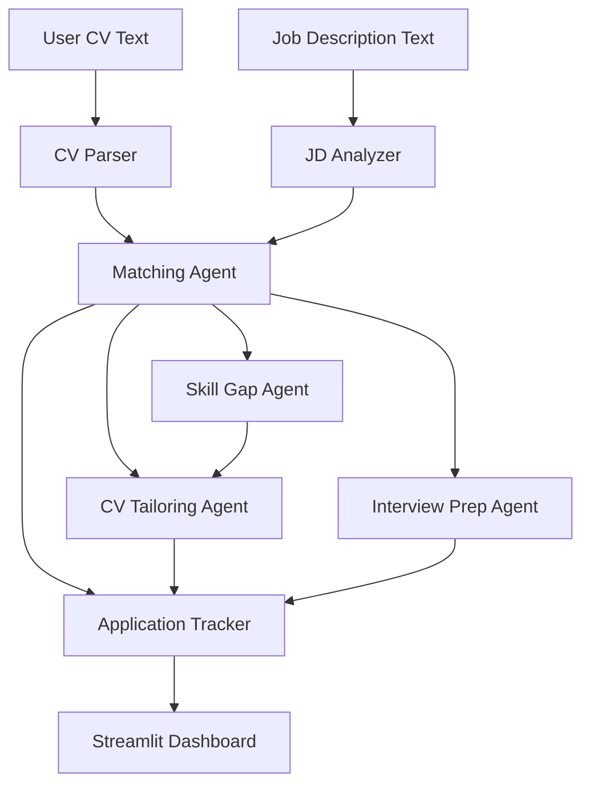

# JobMatch Agent

JobMatch Agent is an intelligent job application assistant for graduate and junior job seekers. It parses a CV, analyzes a job description, compares the candidate against the role, identifies skill gaps, suggests tailored CV content, prepares interview questions, and stores applications in a simple tracker.

## Agent Goal

Help a candidate decide whether a role is realistic and improve the next job application action.

## Features

- CV Parser: extracts education, experience, projects, skills, achievements, and keywords.
- Job Description Analyzer: detects required skills, preferred skills, responsibilities, seniority, industry, and hidden expectations.
- Matching Agent: calculates a match score and explains strong areas, weak areas, missing keywords, risk points, and junior suitability.
- Skill Gap Agent: separates gaps into must improve, can mention as learning, not necessary, and project evidence needed.
- CV Tailoring Agent: generates a resume summary, project bullets, experience bullets, skills section, and cover letter paragraph.
- Interview Prep Agent: creates likely interview questions, STAR answer drafts, technical questions, and a "Why this role?" answer.
- Application Tracker: saves company, role, status, deadline, match score, and next action.

## System Design



The prototype follows a perceive-decide-act loop:

1. Perceive: read CV and JD text.
2. Analyze: extract structured candidate and job features.
3. Decide: compute fit, risks, and job realism.
4. Act: generate CV improvements, interview preparation, and tracker next actions.
5. Remember: save application records in `data/applications.csv`.

## Reproduction Instructions

1. Clone the repository.

```bash
git clone https://github.com/qfay744-1160/job-match-agent.git
cd job-match-agent
```

2. Create and activate a Python environment.

```bash
python -m venv .venv
.venv\Scripts\activate
```

3. Install dependencies.

```bash
pip install -r requirements.txt
```

4. Run the app.

```bash
streamlit run app.py
```

5. Open the local URL shown by Streamlit, usually:

```text
http://localhost:8501
```

## Demo Video

[2-minute demo video](https://drive.google.com/file/d/1fzUz1GM-TwfPGM21FenMd9iL7bzJC-bG/view?usp=drive_link)


