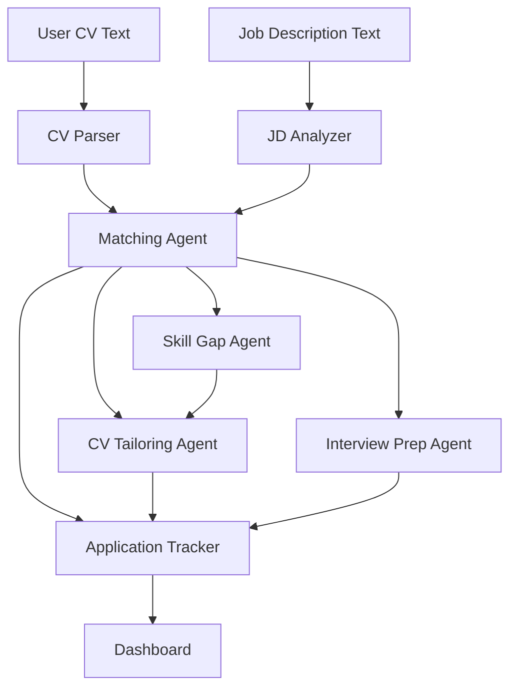
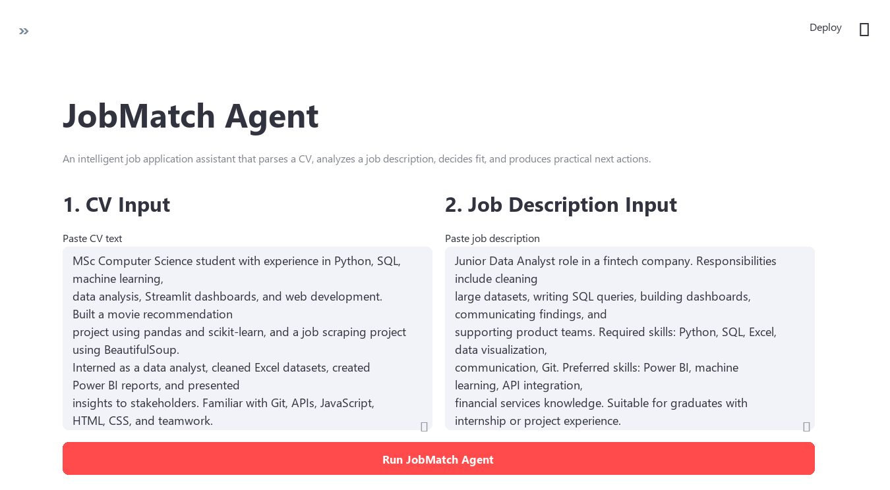
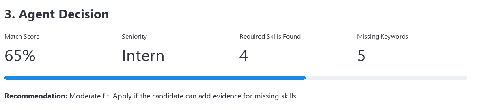

# JobMatch Agent Report

GitHub repository: `<paste your GitHub repo link here>`

## Page 1: System Design

JobMatch Agent is an intelligent job application assistant designed for graduate and junior job seekers. Its goal is to help a user decide whether a job is suitable and then take practical actions to improve the application. The agent perceives two user inputs: a CV and a job description. It then analyzes both inputs, makes a fit decision, and produces actions such as skill gap advice, tailored CV content, interview preparation, and an application tracker entry.

The design follows a perceive-decide-act structure. First, the CV Parser extracts education, work experience, technical skills, projects, achievements, and keywords from the resume. Second, the Job Description Analyzer extracts required skills, preferred skills, responsibilities, seniority level, industry, and hidden expectations. Third, the Matching Agent compares the parsed CV with the analyzed job description and generates a match score, strong match areas, weak areas, missing keywords, and risk points. It also decides whether the role is realistic for a graduate or junior candidate.

After the decision stage, the action agents generate useful outputs. The Skill Gap Agent separates missing abilities into must-improve skills, skills that can be mentioned as currently learning, less important skills, and project evidence needed. The CV Tailoring Agent rewrites the resume summary, project bullet points, experience bullet points, skills section, and a short cover letter paragraph. The Interview Prep Agent creates likely interview questions, STAR answer drafts, technical questions, and a "Why this role?" answer. Finally, the Application Tracker stores the company, role, status, deadline, match score, and next action as simple memory.

## Page 2: Screenshots and System Behavior

Screenshot 1: CV and job description input screen. The user pastes a CV and a job description into the Streamlit dashboard. This demonstrates the perception stage, where the agent receives unstructured text from the user.

Screenshot 2: Match score and gap analysis output. After clicking "Run JobMatch Agent", the system displays the match score, required skills found, missing keywords, recommendation, strong areas, weak areas, and risk points. This demonstrates the decision stage, where the agent evaluates the role against the candidate profile.

Screenshot 3: CV tailoring, interview preparation, and tracker. The system generates resume bullets, a cover letter paragraph, interview questions, STAR answer drafts, and a next action. The user can save the application into a tracker table. This demonstrates the action and memory stage of the agent.

The prototype is intentionally rule-based so that it can run locally without requiring an external LLM API key. This improves reproducibility for assessment and avoids sending private CV data to a third-party service. The system can later be extended with an LLM for more flexible rewriting, stronger natural language understanding, and richer interview coaching.
